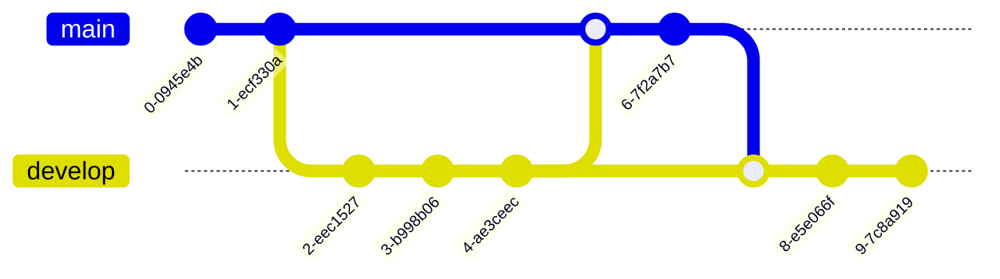
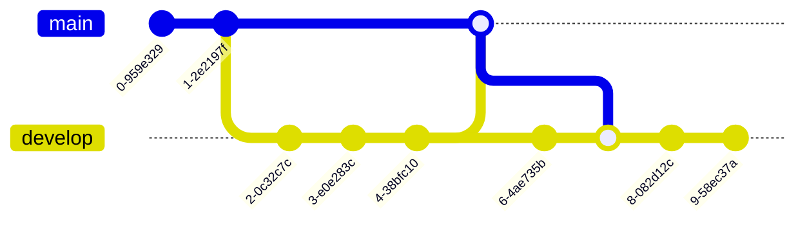

# Using Gitflow with semantic releases

Briefly, Gitflow is a workflow using two branches, one for releases (`production` or `main`) and one for integration (`staging` or `develop`). For this example, `main` is the release branch and `develop` the integration branch. Semantic release uses commit messages following a convention to calculate and apply automated version bumps.

A basic example of Gitflow follows:



In our example, commit 6 is the semantic release commit. Notice the commit is on `main` so to complete the flow, commit 6 must also go back to `develop`.

```shell
git checkout main
npx semantic-release
git push origin HEAD:staging
```

But what if another commit is added to `develop` before the semantic release commit is pushed?


