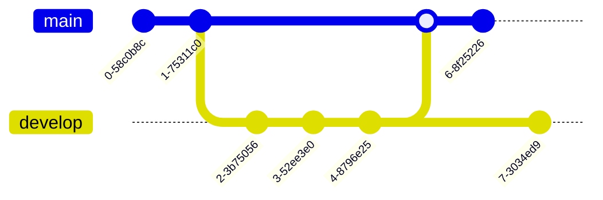

# Using Gitflow with semantic releases

Briefly, Gitflow is a workflow using two branches, one for releases (`production` or `main`) and one for integration (`staging` or `develop`). For this example, `main` is the release branch and `develop` the integration branch. Semantic release uses commit messages following a convention to calculate and apply automated version bumps.

A basic example of Gitflow follows:


In our example, commit 6 is the semantic release commit. Notice the commit is on `main` so to complete the flow, commit 6 must also go back to `develop`.

```shell
git checkout main
npx semantic-release
git push origin HEAD:develop
```

But what if another commit is added to `develop` before the semantic release commit is pushed?



If you try to push the semantic commit to `develop` like before, you'll get an error message like this one:

```shell
git push origin HEAD:staging
# To github.com:littleninja/fictional-barnacle.git
# ! [rejected]        HEAD -> develop (non-fast-forward)
# error: failed to push some refs to 'github.com:littleninja/fictional-barnacle.git'
# hint: Updates were rejected because a pushed branch tip is behind its remote
# hint: counterpart. Check out this branch and integrate the remote changes
# hint: (e.g. 'git pull ...') before pushing again.
# hint: See the 'Note about fast-forwards' in 'git push --help' for details.
```

Instead of pushing, we can rebase. This will:
1. rewinds commits on `develop` (commit 7)
1. applies commits from `main` (commit 6, semantic release)
1. replays new commits on `develop` (commit 7)

Doing a rebase rewrites the commit history and requires force-push. Using `--force-with-lease` option is slightly safer and should fail if another commit (commit 8) is added between `git fetch` and `git push`.

```shell
git checkout main
npx semantic-release
git fetch
git rebase main develop
git push --force-with-lease
```
